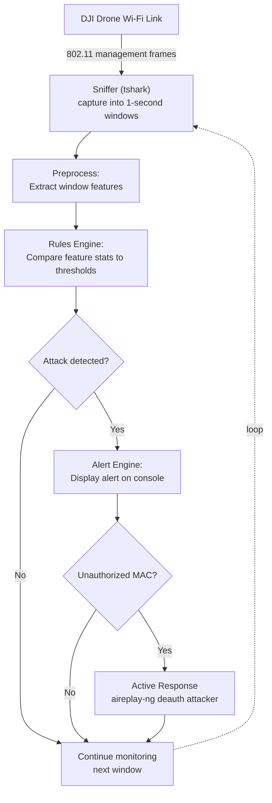

# *An Intrusion Detection/Response System for DJI Drones*

[](https://doi.org/10.2514/6.2026-114726) [](LICENSE) 

**George Mason Cyber Innovation Lab Research - Summer/Winter 2025**


### <u>Table of Contents</u>

***About the Project***

- [Introduction](#introduction)

- [Publication & Recognition](#publications-recognition)

- [Background](#background)

- [Repository Structure](#repository-structure)

***System Design & Research Overview***

- [Research & System Design](#ureseach-system-designu)

- [IDRS Flow Diagram](#idrs-control-flow-diagram)

***Installation & Usage***

- [Requirements](#requirements)

- [Installation](#installation)

- [Usage](#usage)

- [Configuration Reference](#configuration-reference)

***Miscellaneous***

- [Responsible Use Warning](#responsible-use)

- [Citation](#citation)

- [Acknowledgements](#acknowledgments)

- [MIT License](#license)

---


### <u>Introduction</u>

**To provide some context, my name is Joseph Park and I am a student researcher interested in cybersecurity** (specific interests include applied cryptography, AI privacy, cyber-physical systems, and offensive security). Some time ago I hacked a DJI Neo, and I thought the results were interesting enough to post online. As a bonus, I wrote some code for a system that would defend the drone from the very same attacks I created.  This system is also included within the repo. 

**I am about 99% sure that no one besides myself will ever see this, but it is still nice having something on the record, for me to remind and inspire myself**, however obscure and small it may be. As such, assured of my faith that no one will ever read this (and because I was seriously bored), I've added "fun versions"&trade; in parts: very un-rigorous and unserious translations of the technical language. On the off chance the reader is actually interested in using this project (if so, thank you!), I've added technical TL;DRs since, if you can't tell already, my writing is long-winded and markedly rife with filler. The slides or paper (I prefer the slides) are also helpful for a general sense of what this project is. 

---

### Publications & Recognition

This repository is the companion code for the following conference paper and fair submissions:

**Conference Paper:**

> **Real-Time Detection and Active Mitigation of Command-and-Control Link Exploits in Consumer UAVs**
> 
> Joseph Park, Matthew E. Jablonski. AIAA Regional Student Conferences, 2026.
> 
> https://doi.org/10.2514/6.2026-114726
> 
> **Awards:** 1st Place, High School Category, 2026 AIAA Region I Student Conference

**Fair Submissions**

> *2026 Regeneron Westchester Science & Engineering Fair*
> 
> **Awards:** 4th Place, Computer Science; New York Invents Award

> *2026 Tri-County Science & Technology Fair*
> 
> **Awards:** 3rd Place, Engineering & Technology

> *2025 Somers Science Fair*
> 
> **Awards:** 2nd Place, Computer Science

---

### Background

**TL;DR**: *For my research, I created an IDRS that defended DJI drones from Wi-Fi attacks. This project progressed through two phases: first, an initial penetration testing and vulnerability assessment phase was conducted to understand the flaws of the study drone's security protocols. The second phase constructed a system that covered for the security flaws and prevented exploits.*

**Fun Version**

**I had a wonderful opportunity in the summer of 2025 (and into the spring) to work on some drone hacking at George Mason's cybersecurity lab**, and many, many thanks are due to **Dr. Matthew Jablonski** and **Jad Zarzour**, plus **Dr. Duminda Wijesekera** for accepting me into the lab (I seriously can't thank them enough)!

 There was so much awesomeness that I can't share it all here, but basically, the process went like this:

> **Dr. Jablonski/Jad** *teaches me drone hacking*: go ham!
> 
> **Me:** yay! here I go!

(I may be misremembering the details. GMU - my bad!)

**Where did I start?**

I began with recon, vulnerability testing, and pentesting on the drone: the CTFs I'd done before were so, so helpful, and the prerequisite skill these challenges wove into me seriously helped (nothing beats getting hands-on). That being said, working on a real system for the first time was also just incredibly new amazing. Hacking is fun!

> Me: *reverse engineers* hey I could fix some of this stuff!

Very quickly on, I found that the first thing you need to do when hacking something is to get a snack (I love a good bag of popcorn or gummy bears)**. [The second thing I need to do is really, really understand what I'm hacking](https://www.geeksforgeeks.org/cybersecurity/what-is-reverse-engineering-technique-in-cybersecurity/).** How does this process work? What applications does it run? You'll notice these are essentially different forms of the question "Why?" - this is the reverse engineering part. After you understand how the system operates, you can start to think of ways to break it.

What followed is that I then started to think of ways to improve on the flawed design. If you understand how a functionality can be compromised, naturally you begin to say, "Well, I could stop this by just doing this.." and so on. And so began my drone IDRS...

> Brain: you didn't do your AP summer assignments yet and you want to do more work??

I ignored my brain, a decision I would come to seriously rue when the brunt of my academic courseload hit in the dark months of winter. But it led to this...

---

<!-- TODO: awards. Add each as "Placement, Competition Name, Year". Name the competition,

     not personal/location detail. Remove this block if you'd rather not list them.

     Example:

- Finalist, XYZ Regional Science & Engineering Fair, 2025

-->

### Repository structure

<!-- TODO: adjust to match what you actually commit. This reflects the IDS_V3 code you shared. -->

```
drone-idrs-2025/
├── README.md
├── LICENSE
├── CITATION.cff
├── SECURITY.md    
├── requirements.txt
├── config/                     # IDRS configuration file 
│   └── config.yaml
├── src/                        # project source code
│   ├── alert_interface.py       
│   ├── sniffer.py               
│   ├── preprocess.py        
│   ├── rules_analyze.py      
│   └── classify.py              
├── presentations/               # poster, slides, manuscript
│   ├──   ...PDFs              
```

---

### <u>Reseach & System Design</u>

**TL;DR**: *Consumer and FPV drones—including the DJI Neo studied in this project—are frequently vulnerable to attack due to weak passwords, weak encryption, or the absence of security protocols altogether. This project presents IDRS (Intrusion Detection and Response System), a Python-based tool that detects and mitigates two real-world attack vectors identified through months of vulnerability testing: unauthorized Wi-Fi access and deauthentication flooding (a denial-of-service attack). Unlike existing tools such as Kismet, which can detect intrusions but not respond to them, IDRS actively blocks unauthorized devices from connecting to the drone's network. In testing across all attack combinations, IDRS detected 100% of intrusion attempts and prevented all unauthorized Wi-Fi access, with average detection-and-response times of 1–3 seconds.*

Fun Version

**1. Problem**

[Recently, consumer drones have been popping up everywhere](https://www.grandviewresearch.com/industry-analysis/consumer-drone-market) (even my science research teacher has one). People use them for photography, social media, and - my personal favorite - [for racing FPV drones at 90 mph](https://www.youtube.com/watch?v=P25BwtepmUk&pp=ygUQZnB2IGRyb25lIHJhY2luZw%3D%3D) through obstacle courses [like a scene out of the *Planes* Disney movie.](https://www.youtube.com/watch?v=PjyF1r5HkI8) **Unfortunately, these drones are very insecure.** There are many reasons, but I suspect it comes down to cost. If it was cheap and efficient to make these drones secure, there would be no Joseph Park github repo right now. Issues currently plaguing the drone industry are weak passwords, weak encryption, [and some drones who have bravely decided that passwords and encryption are for sissies. ](https://medium.com/@swalters/whereve-you-been-flying-your-drone-s-wi-fi-is-telling-everyone-382af45e7198)

**2. Solution**

After a couple of months of vulnerability testing, and after I found some [actual vulnerabilities](https://github.com/JosephPark23/drone-idrs-2025/blob/main/presentations/GMU%20Vulnerability%20Assessment%20Presentation.pdf), I wrote a system - and IDRS - that detects and protects the DJI Neo I studied from different attacks. The assessment and slides explain in more detail the technical components of the vulnerabilities and IDRS, but there are basically two ways the DJI Neo can be compromised: by accessing the Wi-Fi network or through a [DoS called deauthentication flooding](https://en.wikipedia.org/wiki/Wi-Fi_deauthentication_attack). The system, through some Python scripts, detects for hacking in both vectors, and can prevent unauthorized Wi-Fi access from unknown devices (more about the deauth later).

**3. Results**

[When testing different combinations of attack vectors](https://github.com/JosephPark23/drone-idrs-2025/blob/main/presentations/AIAA_Park_Drones.pdf) (the access, the deauth, and both), the system succeeded in detecting all attacks and mitigating all Wi-Fi access attempts. The system was able to detect and respond within 1-3 seconds on average, and was generally inefficient compared to the Kismet baseline it was compared to. It should be noted that the Kismet did not, however, have a response functionality, which could reduce its usage and increase efficiency. More on this later.

<!-- TODO: drop your poster or a key figure here for a quick visual overview, e.g.:


-->

### IDRS Control Flow Diagram



---

### Limitations, Reflections, and Motivations

**[This project has many, many, many limitations](https://github.com/JosephPark23/drone-idrs-2025/blob/main/presentations/AIAA_Park_Drones.pdf).** Only one drone model was studied in this project because of logistics issues, and the live testing data has a small sample size. Maybe one of the biggest factors that limits practicality is RAM usage and general efficiency. I did not begin with the intention for the IDRS to be a broadly deployed system, so there are many components limiting the effciency: the program scripts are written in Python; the system uses many different system packages and tools; my lack of experience in efficient systems design and programming; and so on. The RAM usage would likely limit much of the IDRS's functionality, and the detection latency of 1-3 seconds is slightly untenable for certain critical purposes: if a drone traveling at 20 meters per second is incapacitated for ~0.5-1 seconds, it has already traveled a distance where many things could go wrong. 

**Another issue is use case**. Unfortunately for me (but fortunately for everyone else), people aren't going around trying to hack everyone else's drones for private information. There's also little to no evidence of these attacks occuring on consumer drones; a bigger current threat would be [battery life](https://mavicpilots.com/threads/quantum-leap-in-battery-duration-for-drones.135821/), reliability of operations, or developing better control technology. 

**Then what, if any, is the purpose of the IDRS, and the project as a whole?** As I mentioned before, [drone security is so notoriously underdeveloped simply because of profit margins and the financial risk](https://www.defenseadvancement.com/suppliers/drone-cybersecurity/#:~:text=and%20communication%20infrastructure-,Challenges%20in%20Implementation,Balancing%20security%20with%20functionality%20requires%20optimized%20cybersecurity%20solutions%20that%20are%20purpose,-%2Dbuilt%20for%20constrained). Drone companies are even a little justified - however tenuous said justification may be - because of the aforementioned lack of attacks on consumer drones. Why sacrifice memory, hardware, space, or computational power on an issue that doesn't exist, in a cutthroat market that rewards innovation and features over security? 

**But in dismissing these concerns, these companies ignore the progagation of commerical drones in modern society, their increasing integration into critical  infrastructure and civil functioning**. Absence of evidence does not necesarily equate to evidence of absence; when drones become [ubiquitious](https://enterprise.dji.com/public-safety/firefighting), [doubling](https://finance.yahoo.com/technology/articles/military-drone-uav-market-reach-140000751.html), then tripling in individual ownership; as drones become more visible and [exposed](https://www.unmannedsystemstechnology.com/feature/using-drones-for-critical-infrastructure-inspection/) in [critical infrastructure](https://www.hstoday.us/subject-matter-areas/unmanned-vehicles/how-drones-are-reshaping-aviation-security-and-critical-infrastructure-protection/) - what is to say that drone attacks won't become a larger issue? Raising awareness and transparency for drone security *now* means we will not be lagging ten years behind in the future.

**This brings me to my second reason, one I considered before pursuing the IDRS phase of this project**. One can dream (and dream big), but realistically, this IDRS is not going to be adopted *en masse* by adoring DJI fans; more likely is that the code will sit here and I will have spent ten hours organizing disparate files for nothing. But establishing that solutions to drone security exist - even if the implementation is clunky and rough in parts - is at least a step fowards for drone security. As far as I can tell, no research has yet been published on a live-tested IDRS for DJI drone Wi-Fi networks, (and extremely little research exists in this area in the first place). Novelty should of course never be pursued for novelty's sake; some sort of significant impact should be the first prerequisite for a research undertaking. Part of this project's impact (I hope) comes from that same issue of future drone security, where the sooner we start, the better off future society will be. 

**The fact that drone security is poor is not simple conjecture. There are many examples, some that I found even in my own research:** when I was conducting vulnerability analyses and reconnaissance, there were oddities. For example, the vulnerability analysis discovered that after accessing the drone's Wi-Fi network, [there was nothing stopping an attacker from intercepting photos and videos](https://github.com/JosephPark23/drone-idrs-2025/blob/main/presentations/GMU%20Vulnerability%20Assessment%20Presentation.pdf), or, for that matter, requesting photos from the drone's internal storage. [There were unused ports open, namely 21 (FTP)](https://github.com/JosephPark23/drone-idrs-2025/blob/main/presentations/GMU%20Wireless%20Reconnaissance%20findings.pdf), exposing an attack surface for no particular nor visible reason. The drone [continually broadcasted the Wi-Fi password](https://github.com/JosephPark23/drone-idrs-2025/blob/main/presentations/GMU%20Wireless%20Reconnaissance%20findings.pdf) on the network (this could be justified by the fact that anyone who compromised the network would already have the password, but this is still redundant and confusing - what purpose does broadcasting the password serve?). And if deauthentication attacks can sever drone-phone communication within seconds, why, DJI, do you continue to implement chipsets that use WPA2 security when there exists an encryption format, [WPA3,](https://www.malwarebytes.com/cybersecurity/basics/what-is-wpa3) that [prevents this very attack](https://mrncciew.com/2025/12/22/how-to-stop-wi-fi-deauth-attacks-wpa3/)? One may argue that upgrading is difficult because of the increased computational power involved, or since it would reduce compatibility, but to this I would say that a) the [additional processing power needed is minimal](https://www.malwarebytes.com/cybersecurity/basics/what-is-wpa3#:~:text=For%20most%20modern%20routers%20and%20devices%2C%20WPA3%20encryption%20has%20minimal%20impact%20on%20performance.%20However%2C%20older%20routers%20or%20low%2Dpower%20IoT%20devices%20may%20experience%20slight%20slowdowns%20due%20to%20increased%20encryption%20processing.%C2%A0), and b) there are [transition/mixed modes](https://www.malwarebytes.com/cybersecurity/basics/what-is-wpa3#:~:text=For%20networks%20with%20older%20devices%20that%20must%20remain%20connected%2C%20enabling%20WPA3/WPA2%20mixed%20mode%20allows%20them%20to%20continue%20working.%20However%2C%20this%20option%20weakens%20overall%20security%2C%20as%20WPA2%E2%80%99s%20vulnerabilities%20still%20exist.%C2%A0) available. Yes, on the mixed modes, WPA2 vulenrabilties exist when using WPA2 connections, but frankly, about every modern smartphone since 2019 has supported WPA3, so to my admittedly inexperienced eye, the compatibility excuse is nonsensical. 

**One of my takeaways of this project** is that, as drone companies grow more important, so too does **the task of holding them accountable for issues and flaws in their designs and products**. If there is no one to call out DJI for their model security decisions, there will almost certainly be an abundance of drones with limited security and correspondingly, unknowing consumers. 

**The other part of the impact is personal.** This is probably the more important, since probably no one will read this paragraph but myself. For me, I had never worked with a real, deployed system before, and the opportunity I had was one I will cherish deeply. To get a little more into my background, I had my first taste of hacking actual systems with simulated challenges in CTFs (picoCTF & National Cyber League represent!). There is a confidence I attained from this project, though, that helped me feel like I really belonged in cybersecurity, that helped feed my dreams of hacking and doing legitmate work. For a foundational experience, it was one of the best choices I could've taken, zand that's something I don't take lightly :)

---

### <u>Installation & Usage</u>

### *Requirements*

**Hardware**

- A Wi-Fi adapter that supports **monitor mode** and frame injection (e.g., Alfa AWUS036AXML).

- A DJI Neo (or another DJI drone; see Limitations) and its controlling phone.

**System tools**

- `tshark` (for the Wireshark CLI)

- `aircrack-ng` provides `aireplay-ng` and `airmon-ng`

- `iw` or `iwconfig` (optional; for channel locking on Linux)

**Python** 3.10+ with the packages in `requirements.txt`:

```
pyyaml
numpy
pandas
```

<!-- TODO: if you also commit the offline ML training scripts (RF/KNN/SVM), add

     scikit-learn, optuna, matplotlib here. The live IDRS itself does not need them. -->

> **Platform note:** detection works on Linux, macOS, and Windows, but **active mitigation (auto-deauth) is Linux-only**, since the feature uses `aireplay-ng`. On Windows the system runs in detect-only mode. Dual-boot or VMs can be used.

---

### Installation

```bash
git clone https://github.com/JosephPark23/drone-idrs-2025.git

cd drone-idrs-2025


# (recommended) venv

python3 -m venv .venv

source .venv/bin/activate


pip install -r requirements.txt
```

Install the system tools (Kali example):

```bash
sudo apt update

sudo apt install tshark aircrack-ng iw
```

---

### Usage

**1. Put your adapter into monitor mode** and note the monitor interface name:

```bash
sudo airmon-ng start wlan0

# creates e.g. wlan0mon
```

**2. Create your config** from the example and fill in your own values:

```bash
cp config/config_example.yaml config/config.yaml
```

Edit `config/config.yaml`:

- `network.drone_mac`: the drone BSSID

- `network.phone_macs`: the controller phone's MAC(s)

- `sniffer.interface`: the monitor interface (e.g., `wlan0mon`)

- `sniffer.bssid`: the same as `drone_mac`

- `sniffer.channel`: if you want to optionally lock to the drone's channel (the Neo commonly uses 149)

**3. Run the IDRS** (root is needed for capture and injection):

```bash
sudo python3 src/alert_interface.py -c config/config.yaml
```

(Add `-v` for verbose logging. Press `Ctrl+C` to stop; a session log is automatically saved to `logs/`.)

---

<!-- TODO: if you want, paste a short sample of the console alert output here in a code block

     so people can see what a detection looks like. -->

##### Configuration reference

Rules settings in `config.yaml` (see the file for the full list):

| Setting | Meaning |
|---|---|
| `rules.deauth_threshold` | Deauth frames targeting an authorized device before alerting |
| `rules.unauth_auth_threshold` | Auth attempts from an unknown MAC before alerting |
| `rules.unauth_assoc_threshold` | Association attempts from an unknown MAC |
| `rules.unauth_packet_pct_threshold` | % of window traffic from unknown MACs that triggers an alert |
| `alerts.alert_cooldown` | Seconds of quiet before an active alert is closed |
| `sniffer.window_size` | Analysis window length in seconds |

---

### <u>Miscellaneous</u>

### Responsible use

This project is intended for **security research and education on equipment you own or are

explicitly authorized to test.** The active-response feature transmits deauthentication

frames; sending deauth frames against networks or devices you do not own may be **illegal**

in many jurisdictions (for example, the U.S. FCC treats Wi-Fi deauthentication/jamming of

others' networks as unlawful). You are responsible for complying with all applicable laws

and regulations. The authors assume no liability for misuse.

---

### Citation

If you use this work, please cite the paper:

```bibtex
@inproceedings{park2026uav,

  author    = {Park, Joseph and Jablonski, Matthew E.},

  title     = {Real-Time Detection and Active Mitigation of Command-and-Control Link Exploits in Consumer UAVs},

  booktitle = {AIAA Regional Student Conferences},

  year      = {2026},

  doi       = {10.2514/6.2026-114726}

}
```

See also [`CITATION.cff`](CITATION.cff).

---

### AI Usage Disclosure

Generative artificial intelligence was used in the writing of the code for the IDRS files, specifically through the use of the PyCharm IDE's builtin code completion agent, Mellum, and the AI models ChatGPT 4 and Claude Sonnet 5 for checking code, improving elegance and syntax errors, and helping with bugs. AI was also used in the writing of the AIAA Conference Paper (a diclosure can be found in the paper as well). AI was also used to make the Installation, Licenses, and Citations sections and whatnot, because I had no idea how to do those things. 

AI was ***not*** used in creating the project (e.g., idea, research plan, methodology), nor in the design of the IDRS itself, nor in the vulnerability analysis/hacking phase. AI was also ***not*** used in the creation of the vulnerability slides, nor poster or reconnaissance report. 

---

### Acknowledgments

I would like to thank Dr. Matthew Jablonski and Jad Zarzour for their work in putting up with my late email replies, my questions, my requests for paperwork, and for being incredible teachers and mentors. It was Dr. Jablonski's idea to submit the project to AIAA and all credit is due to him that this project actually got a DOI (I'm shocked myself). At the incorrigible risk of repeating myself, this was an insane opportunity for me. Not many people get to hack drones, and having this sort of experience - that not only teaches you, but gives you the belief, inspiration, and curiosity to pursue your passion further - is life-changing. Finally, a huge thank you to Dr. Duminda Wijesekera for accepting a random stranger's request to join your lab for the summer. George Mason is a lucky place!

---

### License

<!-- TODO: choose a license (MIT or Apache-2.0 are common for research code) and add the

     LICENSE file. Then state it here, e.g.: -->

Released under the MIT License. See [`LICENSE`](LICENSE).
